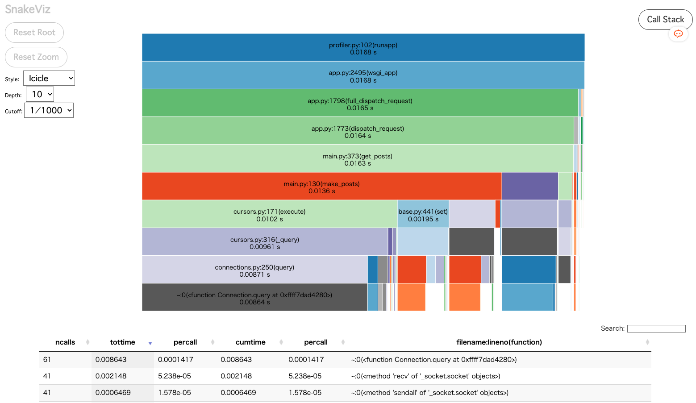
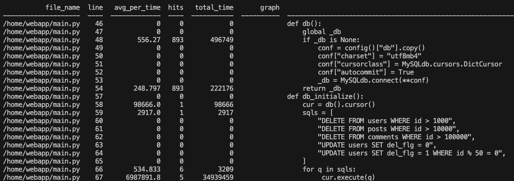
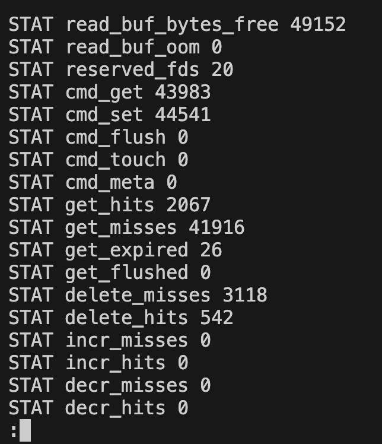

# private-isu

[Pixiv 社内 ISUCON 2016](https://github.com/catatsuy/private-isu)の内容に、[Python実装](https://github.com/methane/pixiv-isucon2016-python/)を追加し、さらにPython用のDockerfileやログ取得・解析用のスクリプトを追加したものです。

なお、ログ解析用スクリプトは[達人が教えるWebパフォーマンスチューニング〜ISUCONから学ぶ高速化の実践](https://gihyo.jp/book/2022/978-4-297-12846-3)を参考にしています。

## ディレクトリ構成

```
├── benchmarker  # ベンチマーカーのソースコード
└── webapp       # 各言語の参考実装
```

* [manual.md](/manual.md)は当日マニュアル。一部社内イベントを意識した記述があるので注意すること。
* [public_manual.md](/public_manual.md) は事前公開レギュレーション

## Docker Composeで動かす

### 事前準備

```sh
# MySQLの初期データのダウンロード
cd webapp/sql
curl -L -O https://github.com/catatsuy/private-isu/releases/download/img/dump.sql.bz2
bunzip2 dump.sql.bz2
cd ../..

# ベンチマーカー用の画像をダウンロード
cd benchmarker/userdata
curl -L -O https://github.com/catatsuy/private-isu/releases/download/img/img.zip
unzip img.zip
rm img.zip
cd ../..
```

### アプリの起動

```sh
make up
# http://0.0.0.0:80 からアプリにアクセスできる
# MySQLの初期データのロードにはかなり時間がかかります。
```

### ベンチマーカーの実行

アプリ起動後にベンチマーカーを実行できます。

```sh
make bench

# ベンチマーカー実行中にコンテナごとの負荷を確認する
make stats
```

### ログの取得

ベンチマーカーを実行後に解析を行うことができます。

```sh
# nginxのアクセスログを解析する
make analyze-nginx-log
# mysqlのスロークエリを解析する
make analyze-mysql-log
# pythonのprofilerを解析する
make analyze-python-log
# memcachedの情報を取得する
#   ベンチマーク前にmake restart-memcachedを実行することを推奨
make analyze-memcached-stats
```

### Dev Containerを用いたデバッグ

devcontainerを用いたPythonのデバッグが可能です。

1. `make down`でコンテナを停止する  
   デバッグするためには、appのportを解放する必要があります
2. コマンドパレットから`Dev Containers: Reopen in Container`を選択する
3. F5キーでデバッグを開始する
4. 適当なコードにブレークポイントを設定し、ブラウザからアクセスするとブレークポイントで停止する  
   MySQLコンテナの初期データのロードには多少時間がかかります

なお、devcontainer用のdocker-compose上でベンチマーカーを実行する場合は以下の手順に従ってください  
（Pythonのプログラムとして起動すると、謎のエラーが発生するのでその対処法です）

1. デバッグ中であれば一旦停止する
2. devcontainer内で、`make run-server`を実行する
3. ホスト上で、`make bench`を実行する

## 解析結果の見方
### docker stats


| 列の名前 | 説明 |
| --- | --- |
| CONTAINER ID と Name | コンテナの ID と名前 |
| CPU % と MEM % | ホスト上の CPU とメモリを、コンテナがどれだけ使っているかパーセントで表示(CPUはコア数x100%が上限) |
| MEM USAGE / LIMIT | コンテナが使っている合計メモリ容量と、利用が許可されている合計メモリ容量 |
| NET I/O | コンテナが自身のネットワークインターフェースを通して送受信したデータ容量 |
| BLOCK I/O | コンテナがホスト上のブロックデバイスから読み書きしたデータ容量 |
| PIDs | コンテナが作成したプロセス数またはスレッド

- [docker stats — Docker-docs-ja 24.0 ドキュメント](https://docs.docker.jp/engine/reference/commandline/stats.html)

### アクセスログ


| 項目 | 意味 |
| --- | --- |
| COUNT | アクセス回数 |
| METHOD | 呼び出したメソッドの種類 |
| URI | 計測したURI |
| MIN | URIへのアクセスにかかる最小アクセス時間(秒) |
| AVG | URIへアクセスするのにかかった時間の平均(秒) |
| MAX | URIへのアクセスにかかる最大アクセス時間(秒) |
| SUM | URIへアクセスするのにかかった時間の合計(秒) |

- https://github.com/tkuchiki/alp
- https://muttan1203.hatenablog.com/entry/how_to_setup_alp

### スロークエリログ

#### 全体のパフォーマンス


| ラベル | 意味 |
| --- | --- |
| total | 合計値 |
| min | 最小値 |
| max | 最大値 |
| avg | 平均値 |
| 95% | 上位95%の合計値 |
| stddev | 標準偏差 |
| median | 中央値 |

| 変数 | 意味 |
| --- | --- |
| Exec time | 実行時間 |
| Lock time | ロック待ち時間 |
| Row sent | 送信回数 |
| Rows exeamine | フェッチした行数 |
| Query size | SQLの値 |

#### クエリのランキング


| ラベル | 意味 |
| --- | --- |
| Response time | 実行時間の和(秒)とスロークエリログ全体に占める割合 |
| Calls | 実行回数 |
| R/Call | 平均値 |
| V/M | 標準偏差 |
| Item | クエリのサマリー |

#### クエリの詳細


| それぞれの要素 | 意味 |
| --- | --- |
| Hosts | クエリーを実行したホスト |
| Users | クエリーを実行したユーザ |
| Query_time distribution | クエリーの実行時間のグラフ化 |
| Tables | 関連するテーブル情報の調査方法 |

- https://gihyo.jp/dev/serial/01/mysql-road-construction-news/0009
- https://nishinatoshiharu.com/percona-slowquerylog/

#### MySQLコマンド集

```sql
#テーブル一覧
SHOW TABLES;

#テーブル構造
SHOW CREATE TABLE <テーブル名>;

#クエリの実行計画
EXPLAIN <クエリ>;
# id: SELECT識別子、実行順序を示してる
# select_type: クエリの種類
#   SIMPLE: サブクエリやユニオンが含まれていない単純なselect文
#   SUBQUERY: select文のサブクエリに指定されているselect文
#   PRIMARY: UNIONの1つめのselect文
#   UNION: UNIONの２つめ以降のselect文
#   UNION_RESULT: UNIONの無名一時テーブルから結果を取得するselect文
# table: 出力の行で参照しているテーブルの名前
# partitions: クエリが参照したパーティションテーブル。パーティションされていない場合はNULL
# type: テーブルの結合方法
#   ALL: フルテーブルスキャン。インデックスがはられていないため一番遅い  <改善を検討>
#   index: フルインデックススキャン。インデックスがはられていること以外はALLと同じ、2番目に遅い  <改善を検討>
#   range: indexを使用して、範囲検索
#   const: PKもしくはuniqueキーを参照して検索、一番速い
#   eq_ref: PKもしくはuniqueキーを参照して検索、constより遅い
#   ref: 非ユニークインデックスを使用して検索
# possible_keys: MySQLがクエリを実行する際に使用できるインデックス
# key: MySQLが実際に使用したインデックス
# key_len: MySQLが実際に使用したインデックスの長さ
# ref: インデックスと比較されるカラムや値
# rows: クエリ実行のためにMySQLが調査する行数
# filtered: テーブル条件によってフィルタ処理される行数の割合
# Extra: MySQLがクエリーを解決する方法に関する追加情報
#   Using filesort: ソートを行うためにファイルソートを行っている
#   Using temporary: クエリーを解決するために一時テーブルを作成している
#   Using index: インデックスを使用している
#   Using where: クエリーの結果を取得するためにWHERE句を使用している

#インデックス作成
ALTER TABLE <テーブル名> ADD INDEX <インデックス名>(<カラム名>);
ALTER TABLE <テーブル名> ADD INDEX <インデックス名>(<カラム名1>, <カラム名2>);
```

### Python profiler



| 項目 | 意味 |
| --- | --- |
| ncalls | 呼び出し回数 |
| tottime | 関数の処理時間の合計(呼び出した関数の処理時間は除外) |
| percall | tottimeをncallsで割った値。一回の実行にかかる平均時間 |
| cumtime | 関数の処理時間の合計(呼び出した関数の処理時間も含める) |
| percall | cumtimeをncallsで割った値。一回の実行にかかる平均時間 |
| filename:lineno(function) | ファイル名、行番号、関数名 |

- https://tech.morikatron.ai/entry/2020/03/06/100000

### Python wlreporter（line profiler）



| column | mean |
| --- | --- |
| file_name | ファイル名 |
| line | 行数 |
| avg_per_time | 平均値(1e-06ms) |
| hits | その行の実行回数 |
| total_time | 合計時間(1e-06ms) |

- https://github.com/denzow/wsgi_lineprof_reporter

### memcached stats



代表的な項目のみ表示

| 項目名 | 説明 |
| --- | --- |
| cmd_get | GETコマンドの累積発行数 |
| cmd_set | SETコマンドの累積発行数 |
| get_hits | GETコマンドがキーにhitした回数 |
| get_misses | GETコマンドがキーにhitしなかった回数 |
| get_expired | GETコマンドがキーにhitしたが、期限切れだった回数 |
| limit_maxbytes | 使用可能な最大メモリ容量（バイト） |
| bytes | 現在使用中のメモリ容量（バイト） |
| listen_disabled_num | コネクション数の不足によりmemcachedから切断されたコネクション数 |
| threads | リクエスト当たりに動作するワーカースレッドの数 |
| curr_items | 現在格納中のアイテム数 |
| total_items | memcachedの起動から現在までに格納した累積アイテム数 |
| evictions | メモリ容量の不足によりmemcachedから追い出されたアイテム数 |

- https://tetsuyai.hatenablog.com/entry/20111221/1324441717

### NetData

現状は利用しない設定になっています。利用する場合は以下の変更が必要です。

1. webapp/docker-compose.ymlのnetdataのコメントアウトを外す
2. http://localhost:19999 からnetdataのUIにアクセスして、モニタリングを行う

### New Relic

現状は利用しない設定になっています。利用する場合は以下の変更が必要です。

1. webapp/docker-compose.ymlのnewrelic-infraのコメントアウトを外す
2. New Relicのアカウントを作成し、webapp/.env.pubを参考に、webapp/.envを作成する
3. webapp/python/Dockerfileを以下のように変更する。また、devcontainer上での実行コマンドも`run-server-newrelic`を利用する
   ```diff
   -CMD gunicorn main:app -b "0.0.0.0:8080" --reload --log-file - --access-logfile -
   +# CMD gunicorn main:app -b "0.0.0.0:8080" --reload --log-file - --access-logfile -
   
   -# # if you want to use newrelic
   -# ENV NEW_RELIC_CONFIG_FILE=newrelic.ini
   -# RUN pip install newrelic
   -# CMD newrelic-admin run-program gunicorn main:app -b "0.0.0.0:8080" --reload --log-file - --access-logfile -
   +# if you want to use newrelic
   +ENV NEW_RELIC_CONFIG_FILE=newrelic.ini
   +RUN pip install newrelic
   +CMD newrelic-admin run-program gunicorn main:app -b "0.0.0.0:8080" --reload --log-file - --access-logfile -
   ```
4. [new relicのwebサイト](https://newrelic.com/jp)にアクセスし、モニタリングを行う

なお、MySQL,nginx,memcachedなどのモニタリングは設定していません。

cf. 環境構築方法

- https://docs.newrelic.com/jp/install/python/
- https://docs.newrelic.com/docs/infrastructure/install-infrastructure-agent/linux-installation/container-infrastructure-monitoring/
